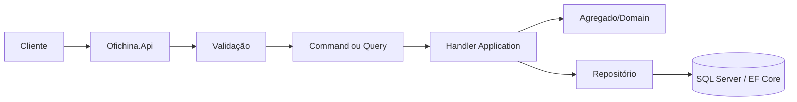

# 📐 Design Approval Sheet (DAS) - Ofichinna

> Documento formal para registrar, revisar e aprovar o design de uma feature significativa antes da implementação.
>
> **Como usar:** copie este arquivo para `docs/das/DAS-XXX-nome-da-feature.md`, preencha todos os campos, relacione os ADRs aplicáveis e obtenha as aprovações antes de iniciar alterações em `src/`.

---

## 🧾 1. Cabeçalho e Metadados

| Campo | Valor |
|---|---|
| **ID** | `DAS-XXX` |
| **Feature** | `[Nome da feature]` |
| **Autor** | `[Nome e e-mail]` |
| **Revisores técnicos** | `[Nomes]` |
| **Aprovadores** | `[Nomes e papéis]` |
| **Data de criação** | `AAAA-MM-DD` |
| **Última revisão** | `AAAA-MM-DD` |
| **Versão** | `1.0` |
| **Status** | `RASCUNHO` |
| **Branch/Issue/PR** | `[Referências]` |
| **ADRs relacionados** | `[ADR-XXX, ADR-YYY]` |

### Status permitidos

`RASCUNHO` · `EM_REVISÃO` · `APROVADO` · `APROVADO_COM_RESSALVAS` · `REJEITADO` · `SUPERADO` · `IMPLEMENTADO`

> Um DAS com status `APROVADO` ou `APROVADO_COM_RESSALVAS` é pré-requisito para iniciar a implementação da feature, salvo correção urgente documentada e aprovada.

---

## 🎯 2. Contexto e Problema

### Contexto

[Descreva o cenário de negócio, usuários envolvidos, motivação e evidências.] 

### Problema

[Qual problema será resolvido? Qual é o impacto de não resolvê-lo?]

### Objetivo

[Resultado esperado em uma frase mensurável.]

### Premissas e restrições

- [Premissa 1]
- [Restrição técnica, regulatória ou de negócio]
- [Dependência externa]

---

## 📦 3. Escopo

### Incluído

- [Comportamento, entidade ou fluxo incluído]
- [Endpoint, tela, integração ou regra incluída]

### Fora de escopo

- [O que explicitamente não será implementado]
- [Evolução futura que não bloqueia esta feature]

### Stakeholders

| Stakeholder | Responsabilidade/interesse |
|---|---|
| `[Nome/papel]` | `[Expectativa]` |

---

## ✅ 4. Requisitos

### 4.1 Requisitos funcionais

| ID | Requisito | Critério verificável |
|---|---|---|
| RF-001 | `[O sistema deve ...]` | `[Como validar]` |
| RF-002 | `[O sistema deve ...]` | `[Como validar]` |

### 4.2 Requisitos não funcionais

| ID | Categoria | Requisito | Métrica/limite |
|---|---|---|---|
| RNF-001 | Segurança | `[Autenticação/autorização]` | `[Regra]` |
| RNF-002 | Desempenho | `[Tempo/volume]` | `[Meta]` |
| RNF-003 | Observabilidade | `[Logs/correlação]` | `[Evento/campo]` |
| RNF-004 | Qualidade | `[Cobertura/análise estática]` | `[Meta]` |

---

## 🏗️ 5. Design Proposto

### 5.1 Visão geral

[Explique o fluxo principal e as responsabilidades por camada.]

### 5.2 Entidades e agregados de domínio

| Componente | Camada/local | Responsabilidade | Regras/invariantes |
|---|---|---|---|
| `[Aggregate Root]` | `Domain/Aggregates` | `[Responsabilidade]` | `[Invariantes]` |
| `[Entidade]` | `Domain/Entities` | `[Responsabilidade]` | `[Relacionamento]` |
| `[Enum/Value Object]` | `Domain/Enums` ou `Domain/Shared` | `[Uso]` | `[Valores válidos]` |

Descreva limites do agregado, identidade, ciclo de vida, métodos de domínio, eventos (se houver) e transações.

### 5.3 Contratos e DTOs

| Tipo | Local | Campos principais | Validação |
|---|---|---|---|
| Request de criação | `Contracts/Requests/...` | `[Campos]` | `[Validator]` |
| Request de atualização | `Contracts/Requests/...` | `[Campos]` | `[Validator]` |
| Response | `Contracts/Responses/...` | `[Campos]` | `[Envelope]` |
| Paginação | `Contracts/Common` | `[Parâmetros]` | `[Limites]` |

Não exponha entidades de domínio diretamente na API. Registre campos obrigatórios, opcionais, enumerações e compatibilidade retroativa.

### 5.4 Commands, Queries e Handlers (CQRS)

| Caso de uso | Tipo | Classe | Entrada/saída | Handler |
|---|---|---|---|---|
| `[Criar feature]` | Command | `[Create...Command]` | `[Request → Result]` | `[Handler]` |
| `[Consultar feature]` | Query | `[Get...Query]` | `[Filtros → Response]` | `[Handler]` |

Commands alteram estado; Queries apenas consultam. Descreva idempotência, transação, regras delegadas ao domínio e tratamento de falhas.

### 5.5 Validação FluentValidation

| Request | Validator | Regras | Retorno inválido |
|---|---|---|---|
| `[CreateRequest]` | `[CreateRequestValidator]` | `[Campos e limites]` | `400 Bad Request` |
| `[UpdateRequest]` | `[UpdateRequestValidator]` | `[Campos e limites]` | `400 Bad Request` |

Diferencie validação de formato/entrada da validação de invariantes de domínio e das regras de existência na aplicação.

### 5.6 Endpoints da API

| Método e rota | Ação | Autorização | Request | Response | Status |
|---|---|---|---|---|---|
| `POST /api/[recurso]` | `[Descrição]` | `[Authorize/Policy/Role]` | `[Request]` | `[ApiResponse<T>]` | `201, 400, 401, 403` |
| `GET /api/[recurso]/{id}` | `[Descrição]` | `[Authorize/Policy/Role]` | `[Route/Query]` | `[ApiResponse<T>]` | `200, 401, 403, 404` |

Para cada action, defina explicitamente `[ProducesResponseType]`, `[Authorize]`/`[AllowAnonymous]`, rota, binding (`FromBody`, `FromRoute`, `FromQuery`) e envelope de resposta. Atualize `docs/API_REFERENCE.md`.

### 5.7 Persistência EF Core e migrations

- **DbSet/tabela:** `[Nome]`
- **Chave e relacionamentos:** `[Descrição]`
- **Índices e restrições:** `[Descrição]`
- **Mapeamento do agregado:** `[Configuration]`
- **Soft delete/auditoria:** `[Regra]`
- **Migration prevista:** `[Nome da migration]`
- **Rollback:** `[Como reverter com segurança]`

A migration deve ser revisada, aplicada em ambiente controlado e validada com `dotnet ef database update` conforme o fluxo do projeto.

### 5.8 Observabilidade e middleware

- `CorrelationIdMiddleware`: `[Como rastrear a requisição]`
- `ApiExceptionMiddleware`: `[Exceções e resposta]`
- Serilog/Seq: `[Eventos e propriedades estruturadas]`
- Métricas/alertas: `[Indicadores]`

---

## 🧱 6. Impacto Arquitetural

| Camada | Impacto | Arquivos/projetos previstos |
|---|---|---|
| Domain | `[Entidade, agregado ou regra]` | `src/Ofichina.Domain` |
| Contracts | `[Requests/responses]` | `src/Ofichina.Contracts` |
| Application | `[Commands, Queries, handlers, validators]` | `src/Ofichina.Application` |
| Infrastructure | `[Repository, EF, migration]` | `src/Ofichina.Infrastructure` |
| Authentication | `[JWT, role ou policy]` | `src/Ofichina.Authentication` |
| API | `[Controller, middleware, Swagger]` | `src/Ofichina.Api` |
| Bootstrap | `[Registro de módulo]` | `src/Ofichina.Bootstrap` |
| Docs/tests | `[Documentos e testes]` | `docs/`, `tests/` |

Confirme dependências permitidas, impacto em contratos existentes, compatibilidade de dados, versionamento e necessidade de atualização dos ADRs.

---

## 🔐 7. Segurança e Autorização

- **Autenticação:** `[JWT/AllowAnonymous]`
- **Perfis/roles:** `[ADMIN, USUARIO, ...]`
- **Policy:** `[Nome em UserPolicyEnum ou nenhuma]`
- **Permissões:** `[Claims/permissões necessárias]`
- **Recursos protegidos:** `[Rotas e operações]`
- **Dados sensíveis:** `[Classificação, mascaramento e retenção]`
- **Validação de entrada:** `[Regras contra abuso/injeção]`
- **Auditoria:** `[Quem, quando, o quê e correlation ID]`

Verifique os cenários sem token, token inválido, role insuficiente, policy insuficiente e acesso permitido. Nunca registre senhas, tokens ou segredos.

---

## 🧪 8. Estratégia de Testes

| Tipo | Projeto/local | Cenários mínimos | Critério |
|---|---|---|---|
| Unitário | `tests/Ofichina.UnitTests` | Entidades, invariantes, validators, handlers | Todos aprovados |
| Integração | `tests/Ofichina.IntegrationTests` | API, banco, autenticação, migrations | Fluxos críticos aprovados |
| Arquitetura | `tests/Ofichina.ArchitectureTests` | Dependências e camadas | Regras arquiteturais aprovadas |
| Contrato/API | Swagger e testes HTTP | Status, payloads, autorização | Contratos compatíveis |
| Análise estática | SonarQube/SonarLint | Bugs, vulnerabilidades, code smells | Sem issues bloqueantes |

Inclua casos de sucesso, validação, não encontrado, conflito, transição inválida, concorrência, autorização e falhas de infraestrutura. Registre cobertura de testes e resultado do Quality Gate do SonarQube.

---

## 🔁 9. Alternativas Consideradas

| Alternativa | Vantagens | Desvantagens | Motivo da decisão |
|---|---|---|---|
| `[Alternativa A]` | `[Vantagens]` | `[Desvantagens]` | `[Escolhida/rejeitada]` |
| `[Alternativa B]` | `[Vantagens]` | `[Desvantagens]` | `[Escolhida/rejeitada]` |

---

## ⚠️ 10. Riscos e Mitigações

| Risco | Probabilidade | Impacto | Mitigação | Responsável |
|---|---|---|---|---|
| `[Risco técnico/negócio]` | Baixa/Média/Alta | Baixo/Médio/Alto | `[Ação preventiva]` | `[Nome]` |

Registre riscos de migração, segurança, desempenho, compatibilidade, concorrência, operação, dados e dependências externas.

---

## 🏁 11. Critérios de Aceite e Definition of Done

### Critérios de aceite

- [ ] Todos os requisitos funcionais foram implementados e demonstrados.
- [ ] Fluxos de sucesso e falha possuem comportamento definido.
- [ ] Contratos e códigos HTTP estão alinhados ao Swagger.
- [ ] Regras de domínio e transições inválidas são cobertas por testes.
- [ ] Segurança e autorização foram validadas nos cenários definidos.

### Definition of Done

- [ ] Código implementado nas camadas corretas.
- [ ] Testes unitários, integração e arquitetura executados.
- [ ] `dotnet build` concluído sem erros relevantes.
- [ ] Migration revisada/aplicada quando necessária.
- [ ] Swagger revisado localmente.
- [ ] Logs, correlation ID e tratamento de exceções revisados.
- [ ] `API_REFERENCE.md`, `README.md`, `INDICE.md` e documentos impactados atualizados.
- [ ] SonarQube/SonarLint revisado e issues bloqueantes resolvidas.
- [ ] Pull request revisado e aprovado.

---

## ✅ 12. Checklist de Aprovação

### Design

- [ ] Problema e objetivo estão claros.
- [ ] Escopo e fora de escopo foram acordados.
- [ ] Alternativas foram analisadas.
- [ ] Impactos e riscos possuem responsáveis.
- [ ] ADRs relacionados foram vinculados ou a ausência foi justificada.

### Implementação planejada

- [ ] Domínio/agregados definidos.
- [ ] DTOs e contratos definidos.
- [ ] Commands, Queries e Handlers definidos.
- [ ] Validadores definidos.
- [ ] Endpoints, `ProducesResponseType` e autorização definidos.
- [ ] Persistência e migrations definidas.
- [ ] Estratégia de testes definida.
- [ ] Diagramas atualizados.

### Validação final

- [ ] `dotnet build` executado.
- [ ] Testes relevantes executados.
- [ ] Testes de arquitetura executados.
- [ ] Swagger validado.
- [ ] SonarQube/SonarLint validado.
- [ ] Documentação atualizada.

---

## ✍️ 13. Registro de Assinaturas e Aprovações

| Papel | Nome | Decisão | Data | Assinatura/Referência |
|---|---|---|---|---|
| Autor | `[Nome]` | Submetido | `AAAA-MM-DD` | `[Link]` |
| Revisor técnico | `[Nome]` | Aprovado/Revisar | `AAAA-MM-DD` | `[Link]` |
| Revisor de segurança | `[Nome]` | Aprovado/Revisar | `AAAA-MM-DD` | `[Link]` |
| Product Owner | `[Nome]` | Aprovado/Revisar | `AAAA-MM-DD` | `[Link]` |
| Arquiteto/aprovador | `[Nome]` | Aprovado/Revisar | `AAAA-MM-DD` | `[Link]` |

### Histórico de versões

| Versão | Data | Autor | Alteração |
|---|---|---|---|
| 1.0 | `AAAA-MM-DD` | `[Nome]` | Criação |

---

**Última atualização:** 2026  
**Versão:** 1.0  
**Status:** ✅ Template disponível para aprovação de designs
