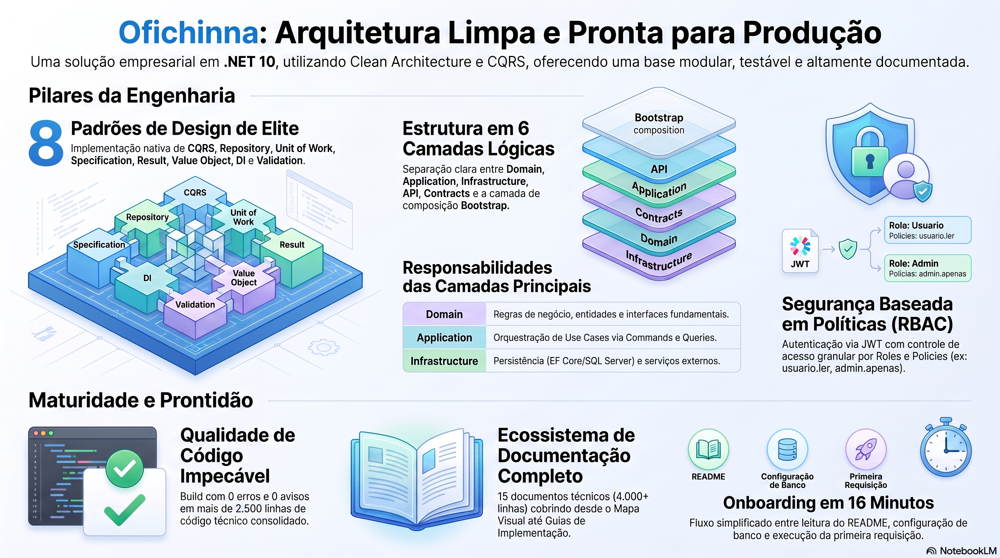

# 📚 OFICHINNA - Clean Architecture .NET 10



## 🎯 Visão Geral

Projeto Ofichinna implementado com **Clean Architecture** e **CQRS Pattern**, utilizando .NET 10, SQL Server, Entity Framework Core e MediatR.

### ✅ Status
- **Implementação**: Consolidada
- **Build**: ✅ Validado
- **Documentação**: ✅ Mantida em evolução contínua
- **Pronto para**: Evolução de features e refinamentos de domínio

---

## 📖 Documentação

### 🔴 COMECE AQUI
1. **[🎯 START_HERE.md](./START_HERE.md)** - Ponto de partida rápido
   - Visão resumida da solução
   - Próximos passos
   - Ordem de leitura
2. **[📋 SUMARIO_EXECUTIVO.md](./SUMARIO_EXECUTIVO.md)** - Visão geral de 5 minutos
   - Status da implementação
   - Números e métricas
   - Quick start
   - Próximos passos

### 🔵 ENTENDA A ARQUITETURA
3. **[🏗️ MAPA_VISUAL.md](./MAPA_VISUAL.md)** - Diagramas e visualizações
   - Estrutura hierárquica completa
   - Fluxo de requisição
   - Ciclo de inicialização
   - Matriz de dependências
   - Exemplo de extensão
   - Dicas de desenvolvimento

4. **[📐 ARQUITETURA.md](./ARQUITETURA.md)** - Referência técnica detalhada
   - Descrição de cada camada
   - Padrões implementados
   - Estrutura de pastas
   - Dependências de NuGet
   - Como usar cada pattern
   - Notas importantes

### 🟢 IMPLEMENTE FEATURES
5. **[📖 GUIA_IMPLEMENTACAO.md](./GUIA_IMPLEMENTACAO.md)** - Guia prático passo-a-passo
   - Exemplo prático completo
   - Checklist para nova feature
   - Padrões de design
   - Código exemplo comentado

6. **[📎 API_REFERENCE.md](./API_REFERENCE.md)** - Referência da API
   - Endpoints de todos os controllers
   - Exemplos de request/response
   - Códigos de status
   - Fluxo atualizado de checklist, orçamento e ordem de serviço

7. **[🧩 DOMINIO_FEATURES.md](./DOMINIO_FEATURES.md)** - Entidades e features
   - Domínios, relacionamentos e operações disponíveis
   - Regras atuais do fluxo comercial

8. **[🤝 CONTRIBUTING.md](./CONTRIBUTING.md)** - Guia de contribuição
   - Regras de documentação
   - Padrões de entrega
   - Checklist antes de PR

9. **[📐 DESIGN_APPROVAL_SHEET.md](./DESIGN_APPROVAL_SHEET.md)** - Template de aprovação de design
   - Obrigatório antes de features de negócio significativas
   - Complementar aos ADRs
   - Exemplo preenchido em `das/`

### 🟡 VALIDAÇÃO E RASTREAMENTO
10. **[✅ RELATORIO_IMPLEMENTACAO.md](./RELATORIO_IMPLEMENTACAO.md)** - Relatório completo
   - Base consolidada da implementação
   - Estrutura de pastas
   - Padrões de design
   - Validação
   - Estatísticas
   - Checklist de qualidade

11. **[🧰 TROUBLESHOOTING.md](./TROUBLESHOOTING.md)** - Suporte operacional
   - Banco de dados
   - Migrations
   - SonarQube
   - Problemas comuns de execução

---

## 🏗️ Estrutura de Projetos

```
Ofichinna/
│
├─ src/
│  ├─ Ofichina.Api/              [Layer: Apresentação]
│  ├─ Ofichina.Authentication/   [Layer: Autenticação e autorização]
│  ├─ Ofichina.Bootstrap/        [Layer: Composição]
│  ├─ Ofichina.Contracts/        [Layer: Contratos]
│  ├─ Ofichina.Application/      [Layer: Aplicação]
│  ├─ Ofichina.Domain/           [Layer: Domínio]
│  └─ Ofichina.Infrastructure/   [Layer: Infraestrutura]
│
├─ tests/
│  ├─ Ofichina.UnitTests/
│  ├─ Ofichina.IntegrationTests/
│  └─ Ofichina.ArchitectureTests/
│
└─ docs/
   ├─ README.md
   ├─ START_HERE.md
   ├─ QUICK_REFERENCE.md
   ├─ SUMARIO_EXECUTIVO.md
   ├─ API_REFERENCE.md
   ├─ DESIGN_APPROVAL_SHEET.md
   ├─ DOMINIO_FEATURES.md
   ├─ LOGGING.md
   ├─ EXEMPLOS_CORRELATION_ID.md
   ├─ DOCUMENTACAO_COMPLETA.md
   ├─ CONCLUSAO.md
   ├─ RESUMO_FINAL.md
   ├─ mediatr.md
   ├─ MAPA_VISUAL.md
   ├─ ARQUITETURA.md
   ├─ GUIA_IMPLEMENTACAO.md
   ├─ AUTORIZACAO-RBAC-POLICIES.md
   ├─ TROUBLESHOOTING.md
   ├─ CONTRIBUTING.md
   ├─ INDICE.md
   ├─ RELATORIO_IMPLEMENTACAO.md
   ├─ das/
   ├─ DAS-001-exemplo-ordem-servico.md
   └─ DAS-002-fluxo-orcamento.md
   ├─ adr/
   │  ├─ ADR-001 - Clean-Architecture-DDD.md
   │  ├─ ADR-002 - Adocao-CQRS-Application.md
   │  ├─ ADR-003 - Banco-Dados-Relacional.md
   │  ├─ ADR-004 - Adoção do Entity Framework Core como ORM.md
   │  ├─ ADR-005 - Organização da Solução por Camadas e Projetos.md
   │  ├─ ADR-006 - Estratégia para Validações com FluentValidation.md
   │  ├─ ADR-007 - Autorizacao-RBAC-e-Policies.md
   │  └─ ADR-008 - Estrategia-Validacoes-FluentValidation.md
   └─ Documentacao Inicial Projeto/
```

> A solução contém 10 projetos e segue uma separação clara entre apresentação, autenticação, composição, contratos, aplicação, domínio, infraestrutura e testes.

---

## 🚀 Quick Start

### 1. Configurar Banco de Dados
```json
{
  "ConnectionStrings": {
    "DefaultConnection": "Server=localhost,1433;Database=ofichinna;User Id=sa;Password=<SENHA>;TrustServerCertificate=True"
  },
  "Jwt": {
    "Issuer": "ofichinna",
    "Audience": "ofichinna",
    "Key": "<CHAVE_JWT>"
  }
}
```

> O `ApplicationDbContextFactory` lê `ConnectionStrings__DefaultConnection` do ambiente ou do arquivo `.env`, o que permite usar `dotnet ef` em design-time sem acoplar a string de conexão ao código.

### 2. Criar Migrations
```bash
dotnet ef migrations add InitialAuth -p src/Ofichina.Infrastructure
dotnet ef database update -p src/Ofichina.Infrastructure
```

> O projeto `Ofichina.Infrastructure` já possui `ApplicationDbContextFactory` para suportar o `dotnet ef` em design-time.

### 3. Executar
```bash
dotnet run --project src/Ofichina.Api
```

Acesse: `https://localhost:7109/swagger`

---

## 🎯 Padrões Implementados

| Padrão | Local | Descrição |
|--------|-------|-----------|
| **CQRS** | Application/UseCases + Contracts | Commands (escrita) e Queries (leitura) |
| **Mediator** | Application + MediatR | Desacoplamento entre requests e handlers |
| **Repository** | Application/Abstractions + Infrastructure/Repositories | Abstração de persistência |
| **Unit of Work** | Application/Abstractions + Infrastructure/Repositories | Gerenciamento de transações |
| **Specification** | Contracts/Specifications | Critérios de consulta encapsulados |
| **Result** | Contracts/Common | Resultado com sucesso/erro |
| **Value Object** | Domain/ValueObjects | Objetos imutáveis por valor |
| **DI** | Bootstrap + Application/DependencyInjection + Infrastructure/Modules + Authentication/DependencyInjection | Modularidade e inversão de controle |
| **Validation** | Application/Validators + Authentication/Validators | FluentValidation integrado |
| **Security** | Authentication + Contracts/Enums | JWT, roles e permissões granulares |

---

## 📦 Dependências

```xml
<PackageReference Include="DotNetEnv" Version="3.2.0" />
<PackageReference Include="Microsoft.AspNetCore.Authentication.JwtBearer" Version="10.0.9" />
<PackageReference Include="Microsoft.AspNetCore.OpenApi" Version="10.0.9" />
<PackageReference Include="Microsoft.EntityFrameworkCore" Version="10.0.9" />
<PackageReference Include="Microsoft.EntityFrameworkCore.SqlServer" Version="10.0.9" />
<PackageReference Include="MediatR" Version="12.5.0" />
<PackageReference Include="FluentValidation" Version="11.9.2" />
<PackageReference Include="FluentValidation.DependencyInjectionExtensions" Version="11.9.2" />
<PackageReference Include="Serilog.AspNetCore" Version="10.0.0" />
<PackageReference Include="Serilog.Sinks.Seq" Version="9.0.0" />
<PackageReference Include="Swashbuckle.AspNetCore" Version="10.2.3" />
```

---

## 🔄 Fluxo de Inicialização

```
Env.TraversePath().Load()
Program.cs
    ↓
Serilog / Controllers / Swagger / Bootstrap
    ↓
AddBootstrapMiddleware(configuration)
    ├─ AddAuthorizationModule()
    ├─ AddAuthenticationModules(configuration)
    ├─ AddAuthorizationResultHandlerModule()
    ├─ AddAuthenticationServices()
    ├─ AddApplication()
    └─ AddInfrastructure(configuration)
    ↓
UseCorrelationId()
UseMiddleware<ApiExceptionMiddleware>()
UseSwaggerModule() [Development]
UseAuthentication()
UseAuthorization()
MapControllers()
```

---

## 📋 Exemplo: Criar Nova Entidade

Seguindo este passo-a-passo (consulte GUIA_IMPLEMENTACAO.md para detalhes):

```
1. Criar Entidade ou Aggregate em Domain/Entities/ ou Domain/Aggregates/
2. Criar Request/Response em Contracts/ se a API exigir contrato novo
3. Criar Interface em Application/Abstractions/Interfaces/
4. Implementar Repositório ou Serviço em Infrastructure/Repositories/ ou Infrastructure/Services/
5. Registrar no módulo correspondente em Infrastructure/Modules/
6. Ajustar o ApplicationDbContext e as Configurations em Infrastructure/Persistence/
7. Criar Validador em Application/Validators/
8. Criar Command/Query em Application/UseCases/
9. Criar Handler em Application/UseCases/
10. Criar Controller em Api/Controllers/
```

Veja exemplo completo em **GUIA_IMPLEMENTACAO.md**

---

## 📊 Estatísticas

| Métrica | Valor |
|---------|-------|
| Projetos | 10 |
| Documentos Markdown | 30+ |
| Controllers documentados | 14 |
| Endpoints documentados | 68 |
| Entidades/features | 10+ domínios e fluxos principais |
| Padrões de Design | CQRS, Mediator, Repository, Unit of Work, Specification, Result, Value Object, DI, Validation, Security |
| Módulos da API | Swagger, Correlation ID, exceções, autenticação, autorização e logging |
| Camadas/projetos | 10 projetos na solução |
| Build Status | ✅ Validado |
| Erros | 0 |

---

## 🎓 Referências e Leitura

### Documentação Oficial
- [Clean Architecture - Uncle Bob](https://blog.cleancoder.com/uncle-bob/2012/08/13/the-clean-architecture.html)
- [CQRS Pattern - Martin Fowler](https://martinfowler.com/bliki/CQRS.html)
- [Entity Framework Core](https://docs.microsoft.com/en-us/ef/core/)
- [FluentValidation](https://docs.fluentvalidation.net/)
- [Microsoft.Extensions.DependencyInjection](https://docs.microsoft.com/en-us/dotnet/api/microsoft.extensions.dependencyinjection)

### Documentação Local
- 📖 [START_HERE.md](./START_HERE.md) - Ponto de partida
- 📖 [QUICK_REFERENCE.md](./QUICK_REFERENCE.md) - Comandos e consulta rápida
- 📖 [SUMARIO_EXECUTIVO.md](./SUMARIO_EXECUTIVO.md) - Visão geral
- 📖 [MAPA_VISUAL.md](./MAPA_VISUAL.md) - Diagramas
- 📖 [ARQUITETURA.md](./ARQUITETURA.md) - Referência técnica
- 📖 [GUIA_IMPLEMENTACAO.md](./GUIA_IMPLEMENTACAO.md) - Guia prático
- 📖 [DOMINIO_FEATURES.md](./DOMINIO_FEATURES.md) - Entidades e features
- 📖 [RELATORIO_IMPLEMENTACAO.md](./RELATORIO_IMPLEMENTACAO.md) - Relatório
- 📖 [API_REFERENCE.md](./API_REFERENCE.md) - Contratos e exemplos da API
- 📐 [DESIGN_APPROVAL_SHEET.md](./DESIGN_APPROVAL_SHEET.md) - Template de aprovação de design
- 📐 [das/DAS-001-exemplo-ordem-servico.md](./das/DAS-001-exemplo-ordem-servico.md) - Exemplo preenchido
- 📐 [das/DAS-002-fluxo-orcamento.md](./das/DAS-002-fluxo-orcamento.md) - Aprovação do fluxo de orçamento
- 📖 [LOGGING.md](./LOGGING.md) - Serilog, Seq e correlação
- 📖 [EXEMPLOS_CORRELATION_ID.md](./EXEMPLOS_CORRELATION_ID.md) - Exemplos de correlação
- 📖 [DOCUMENTACAO_COMPLETA.md](./DOCUMENTACAO_COMPLETA.md) - Mapa da documentação
- 📖 [CONCLUSAO.md](./CONCLUSAO.md) - Conclusão
- 📖 [RESUMO_FINAL.md](./RESUMO_FINAL.md) - Resumo final
- 📖 [mediatr.md](./mediatr.md) - Uso de MediatR
- 📖 [AUTORIZACAO-RBAC-POLICIES.md](./AUTORIZACAO-RBAC-POLICIES.md) - Autorização
- 📖 [INDICE.md](./INDICE.md) - Índice completo
- 📖 [adr/](./adr/) - Architecture Decision Records
- 📖 [CONTRIBUTING.md](./CONTRIBUTING.md) - Padrões de contribuição
- 📖 [TROUBLESHOOTING.md](./TROUBLESHOOTING.md) - Solução de problemas

### 🧭 Quando usar DAS ou ADR?

- Use um **DAS** antes de implementar uma feature significativa: ele descreve o problema, escopo, contratos, fluxo, testes, riscos e aprovação daquela feature.
- Use um **ADR** quando a mudança registrar uma decisão arquitetural duradoura e transversal, como Clean Architecture, CQRS, EF Core ou RBAC.
- Um DAS deve referenciar os ADRs aplicáveis; um DAS não substitui um ADR quando a feature altera a arquitetura da solução.

---

## ✅ Checklist de Implementação

### Antes de Começar
- [ ] Ler SUMARIO_EXECUTIVO.md (5 min)
- [ ] Entender arquitetura com MAPA_VISUAL.md
- [ ] Revisar ARQUITETURA.md para detalhes técnicos

### Configuração Inicial
- [ ] Configurar appsettings.json
- [ ] Executar migrations
- [ ] Testar projeto com `dotnet run`
- [ ] Acessar Swagger

### Primeira Feature
- [ ] Consultar GUIA_IMPLEMENTACAO.md
- [ ] Criar entidade (Domain)
- [ ] Criar repositório (Infrastructure)
- [ ] Criar handlers (Application)
- [ ] Criar controller (Api)
- [ ] Testar endpoints

### Continuação
- [ ] Implementar mais entidades
- [ ] Adicionar autenticação
- [ ] Criar testes
- [ ] Documentar API
- [ ] Preparar deploy

---

## 🎯 Objetivo do Projeto

Clean Architecture implementada com .NET 10, facilitando:
- ✅ Manutenibilidade
- ✅ Testabilidade
- ✅ Escalabilidade
- ✅ Separação de responsabilidades
- ✅ Reutilização de código
- ✅ Onboarding de novos desenvolvedores

---

## 💬 Dúvidas Frequentes

**P: Por onde começo?**  
R: Leia SUMARIO_EXECUTIVO.md (5 min), depois MAPA_VISUAL.md (10 min).

**P: Como adiciono uma nova entidade?**  
R: Siga o passo-a-passo em GUIA_IMPLEMENTACAO.md ou ARQUITETURA.md.

**P: O que cada camada faz?**  
R: Veja MAPA_VISUAL.md na seção "Mapeamento de Responsabilidades".

**P: Que padrões foram usados?**  
R: Os principais padrões estão documentados em ARQUITETURA.md e RELATORIO_IMPLEMENTACAO.md: CQRS, Mediator, Repository, Unit of Work, Specification, Result, Value Object, DI, Validation e Security.

**P: Posso usar MediatR?**  
R: Sim. A solução já utiliza MediatR para desacoplar handlers de comandos e consultas.

**P: Como testar?**  
R: Crie testes em projects `Ofichina.UnitTests` e `Ofichina.IntegrationTests`.

---

## 📞 Suporte

Para dúvidas sobre a implementação:
1. Consulte a documentação local
2. Revise os exemplos em GUIA_IMPLEMENTACAO.md
3. Verifique ARQUITETURA.md para padrões específicos

---

## 📝 Changelog

### v2.0 - 2026
- ✅ Clean Architecture implementada
- ✅ CQRS e MediatR integrados
- ✅ Autenticação JWT e RBAC por perfis/permissões
- ✅ Entity Framework Core 10 integrado
- ✅ FluentValidation configurado
- ✅ Swagger, Serilog e Correlation ID configurados
- ✅ Documentação atualizada com visão da arquitetura e da API
- ✅ Fluxo de orçamento, checklist e ordem de serviço alinhado ao domínio atual
- ✅ Build validado

---

## 🎉 Status Final

```
┌─────────────────────────────────────────┐
│ IMPLEMENTAÇÃO CONCLUÍDA COM SUCESSO ✅ │
└─────────────────────────────────────────┘

Build:           ✅ Validado
Arquitetura:     ✅ Clean Architecture
Padrões:         ✅ 10+ implementados
Documentação:    ✅ Ampliada e atualizada
Exemplos:        ✅ Inclusos
Pronto para:     ✅ Desenvolvimento
```

---

## 🚀 Começar Agora!

1. **[📋 SUMARIO_EXECUTIVO.md](./SUMARIO_EXECUTIVO.md)** - Leia agora (5 min)
2. **[🏗️ MAPA_VISUAL.md](./MAPA_VISUAL.md)** - Entenda a arquitetura (10 min)
3. **[📖 GUIA_IMPLEMENTACAO.md](./GUIA_IMPLEMENTACAO.md)** - Implemente sua feature
4. **[📎 API_REFERENCE.md](./API_REFERENCE.md)** - Consulte contratos e exemplos
5. **[🤝 CONTRIBUTING.md](./CONTRIBUTING.md)** - Siga os padrões do projeto

---

**Última atualização:** 2026  
**Versão:** 2.0  
**Status:** ✅ PRONTO PARA EVOLUIR

---

*Para questões técnicas, consulte a documentação fornecida ou revise os exemplos de implementação.*