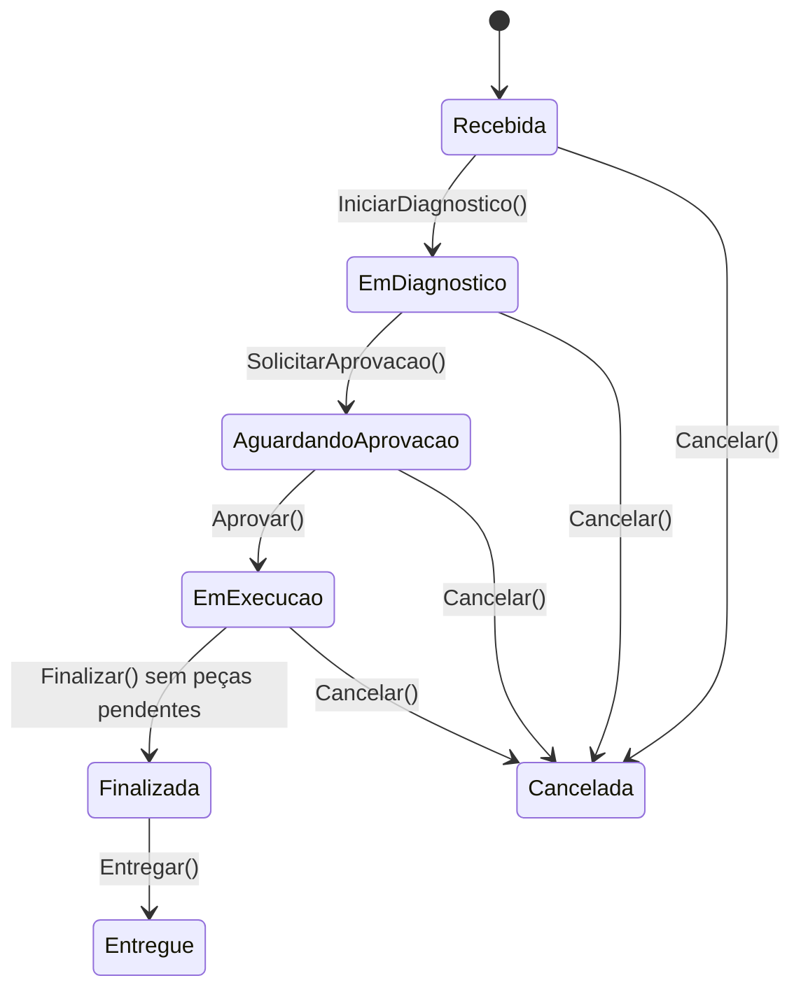

# 📐 DAS-001 — Ciclo de vida da Ordem de Serviço

> **Exemplo preenchido:** este documento demonstra como utilizar o template de Design Approval Sheet. As aprovações identificadas como exemplo não substituem a aprovação formal de uma feature real.

---

## 🧾 1. Cabeçalho e Metadados

| Campo | Valor |
|---|---|
| **ID** | `DAS-001` |
| **Feature** | Ciclo de vida e operações da Ordem de Serviço |
| **Autor** | Equipe de Arquitetura — exemplo |
| **Revisores técnicos** | Application, Domain e API — a confirmar |
| **Aprovadores** | Product Owner e Arquiteto — a confirmar |
| **Data de criação** | `2026-07-26` |
| **Última revisão** | `2026-07-26` |
| **Versão** | `1.0` |
| **Status** | `APROVADO_COM_RESSALVAS` — exemplo didático |
| **Branch/Issue/PR** | `[preencher na feature real]` |
| **ADRs relacionados** | ADR-001, ADR-002, ADR-003, ADR-004, ADR-006 e ADR-007 |

### Ressalvas do exemplo

1. O agregado possui `UtilizarPeca`, mas o controller atual não expõe uma action dedicada para essa operação.
2. Os endpoints atuais de transição são administrativos e usam a role `ADMIN`.
3. Este DAS documenta o design e o estado implementado de referência; qualquer alteração futura deve gerar nova versão ou novo DAS.

---

## 🎯 2. Contexto e Problema

### Contexto

A oficina precisa acompanhar o atendimento de um veículo desde a abertura da ordem de serviço até a entrega ao cliente. A ordem relaciona uma pessoa, um veículo, um funcionário responsável e os itens de serviço que compõem o atendimento.

O agregado `OrdemServico`, em `src/Ofichina.Domain/Aggregates/OrdemServico.cs`, é o Aggregate Root responsável por controlar o ciclo de vida, os itens de serviço, as peças e o valor total da ordem.

### Problema

Sem uma máquina de estados centralizada, a API poderia permitir diagnóstico, aprovação, execução, finalização ou entrega em ordem inválida, além de permitir alterações de itens depois do momento permitido.

### Objetivo

Garantir que toda mudança de estado e toda alteração de itens respeite as invariantes do agregado, seja exposta por contratos consistentes e possa ser validada, testada e auditada.

### Premissas e restrições

- O estado inicial é `Recebida`.
- A persistência usa EF Core e SQL Server.
- O fluxo de aplicação usa Commands, Queries e Handlers.
- O controller atual exige `ADMIN` nas actions da ordem de serviço.
- A resposta pública usa `ApiResponse` e os contratos em `Ofichina.Contracts`.

---

## 📦 3. Escopo

### Incluído

- Criação, consulta e atualização da ordem de serviço.
- Consulta paginada e consulta detalhada.
- Transições de diagnóstico, aprovação, execução, finalização, entrega e cancelamento.
- Relacionamento com `Pessoa`, `Veiculo`, `FuncionarioId` e `ItemServico`.
- Cálculo de `ValorTotal` a partir de itens e peças ativas.
- Validação de regras do agregado e requests.
- Documentação de API, testes e autorização.

### Fora de escopo

- Criação de uma tela frontend.
- Notificações externas ao cliente.
- Endpoint dedicado para `UtilizarPeca`.
- Alteração do modelo de autorização para permissões granulares.
- Event Sourcing, banco de leitura separado ou mensageria.
- Alteração do código-fonte neste documento de exemplo.

### Stakeholders

| Stakeholder | Responsabilidade/interesse |
|---|---|
| Cliente | Aprovar o serviço e receber o veículo |
| Atendente/mecânico | Registrar e executar o atendimento |
| Administrador | Operar a API e controlar o fluxo |
| Product Owner | Validar regras de negócio |
| Arquitetura/QA | Validar design, qualidade e testes |

---

## ✅ 4. Requisitos

### 4.1 Requisitos funcionais

| ID | Requisito | Critério verificável |
|---|---|---|
| RF-001 | Criar a OS com pessoa, veículo, funcionário, hodômetro e problema relatado | Request válido cria a OS no estado `Recebida` |
| RF-002 | Consultar OS paginada | Retorna `PagedResponse<OrdemServicoSimplesResponse>` |
| RF-003 | Consultar OS por identificador | Retorna `OrdemServicoResponse` ou `404` |
| RF-004 | Atualizar dados da OS | Atualiza dados permitidos e modifica a data de alteração |
| RF-005 | Iniciar diagnóstico | `Recebida → EmDiagnostico` |
| RF-006 | Solicitar aprovação | `EmDiagnostico → AguardandoAprovacao` |
| RF-007 | Aprovar execução | `AguardandoAprovacao → EmExecucao` |
| RF-008 | Finalizar atendimento | `EmExecucao → Finalizada`, somente sem peças pendentes |
| RF-009 | Entregar veículo | `Finalizada → Entregue` |
| RF-010 | Cancelar OS | Qualquer estado não finalizado/entregue pode ir para `Cancelada` |
| RF-011 | Controlar itens | Alterações de itens somente em `Recebida` ou `EmDiagnostico` |

### 4.2 Requisitos não funcionais

| ID | Categoria | Requisito | Métrica/limite |
|---|---|---|---|
| RNF-001 | Arquitetura | Regras de negócio devem permanecer no domínio | Sem regra de transição no controller |
| RNF-002 | Segurança | Actions administrativas exigem autenticação e role | `401` sem token; `403` sem `ADMIN` |
| RNF-003 | Contrato | API deve declarar tipos e status com Swagger | `ProducesResponseType` em todas as actions |
| RNF-004 | Observabilidade | Requisições e falhas devem ser rastreáveis | Serilog + Correlation ID |
| RNF-005 | Qualidade | Fluxos e transições inválidas devem ter testes | Unitários, integração e arquitetura |

---

## 🏗️ 5. Design Proposto

### 5.1 Visão geral



O método `Cancelar()` rejeita cancelamento quando o status é `Finalizada` ou `Entregue`. As transições são protegidas no domínio por `ValidarStatus`, impedindo chamadas fora da etapa esperada.

### 5.2 Entidades e agregados de domínio

| Componente | Local | Responsabilidade |
|---|---|---|
| `OrdemServico` | `Domain/Aggregates/OrdemServico.cs` | Aggregate Root, estado, regras, itens e valor total |
| `ItemServico` | `Domain/Entities/ItemServico.cs` | Serviço previsto/executado dentro da OS |
| `ServicoPeca` | `Domain/Entities/ServicoPeca.cs` | Peça vinculada ao item/serviço |
| `Pessoa` | `Domain/Entities/Pessoa.cs` | Proprietário relacionado à ordem |
| `Veiculo` | `Domain/Entities/Veiculo.cs` | Veículo atendido |
| `StatusOrdemServico` | `Domain/Enums/StatusOrdemServico.cs` | Enum com sete estados oficiais |
| `Entity` | `Domain/Entities/Entity.cs` | Identidade e auditoria base |

### Invariantes do agregado

- `PessoaId`, `VeiculoId` e `FuncionarioId` não podem ser `Guid.Empty`.
- `HodometroEntrada` não pode ser negativo.
- `ProblemaRelatado` é obrigatório.
- Uma OS nova inicia com `StatusOrdemServico.Recebida` e `DataAbertura` em UTC.
- `ValorTotal` soma os itens não excluídos.
- Itens só podem ser alterados em `Recebida` ou `EmDiagnostico`.
- `Finalizar()` exige `EmExecucao` e nenhuma peça ativa pendente de utilização.
- `Finalizar()` registra `DataFinalizacao` em UTC.
- `Entregar()` exige `Finalizada`.
- `Cancelar()` não permite cancelar OS `Finalizada` ou `Entregue`.

### 5.3 Contratos e DTOs

| Operação | Request | Response/retorno |
|---|---|---|
| Criar | `CreateOrdemServicoRequest` | `ApiResponse` com mensagem |
| Atualizar | `UpdateOrdemServicoRequest` | `ApiResponse` |
| Listar | `Pagination` | `ApiResponse<PagedResponse<OrdemServicoSimplesResponse>>` |
| Consultar | rota `id` | `ApiResponse<OrdemServicoResponse>` |
| Transição | rota `id` | `ApiResponse` com mensagem |

#### CreateOrdemServicoRequest

```json
{
  "pessoaId": "550e8400-e29b-41d4-a716-446655440000",
  "veiculoId": "660e8400-e29b-41d4-a716-446655440000",
  "funcionarioId": "770e8400-e29b-41d4-a716-446655440000",
  "hodometroEntrada": 35000,
  "problemaRelatado": "Ruído no motor",
  "observacoes": "Avaliar correia"
}
```

> O contrato usa `Observacoes`; a entidade usa `Observacao`. O mapeamento entre contrato e domínio deve ser explícito no command/handler.

#### UpdateOrdemServicoRequest

```json
{
  "id": "550e8400-e29b-41d4-a716-446655440000",
  "pessoaId": "660e8400-e29b-41d4-a716-446655440000",
  "veiculoId": "770e8400-e29b-41d4-a716-446655440000",
  "funcionarioId": "880e8400-e29b-41d4-a716-446655440000",
  "hodometroEntrada": 35000,
  "problemaRelatado": "Ruído no motor",
  "observacoes": "Dados revisados"
}
```

### 5.4 Commands, Queries e Handlers (CQRS)

O controller atual utiliza MediatR para enviar os casos de uso da camada Application:

| Caso de uso | Tipo | Entrada |
|---|---|---|
| `CreateOrdemServicoCommand` | Command | `CreateOrdemServicoRequest` |
| `UpdateOrdemServicoCommand` | Command | `UpdateOrdemServicoRequest` |
| `GetAllOrdensServicoPaginadasQuery` | Query | `Pagination` |
| `GetOrdemServicoByIdQuery` | Query | `Guid Id` |
| Alteração de status | Command | `id`, status destino e mensagem |

O handler deve carregar o agregado, invocar métodos de domínio (`IniciarDiagnostico`, `SolicitarAprovacao`, `Aprovar`, `Finalizar`, `Entregar` ou `Cancelar`), persistir a unidade de trabalho e converter falhas em `Result`/`ApiResponse`.

### 5.5 Validação FluentValidation

- `IValidator<CreateOrdemServicoRequest>` valida a criação.
- `IValidator<UpdateOrdemServicoRequest>` valida a atualização.
- Validadores verificam entrada e formato; invariantes de ciclo de vida permanecem em `OrdemServico`.
- Falhas de validação retornam `400 Bad Request`.
- Entidade inexistente ou falha de regra de negócio deve manter o mapeamento definido pelo handler/controller.

### 5.6 Endpoints da API

Controller: `src/Ofichina.Api/Controllers/OrdemServico/OrdemServicoController.cs`  
Rota base: `/api/ordem-servico`  
Autorização efetiva: `[Authorize]` no controller e `[Authorize(Roles = "ADMIN")]` nas actions. Não há policy nomeada ativa nas actions atuais.

| Método e rota | Ação | Response principal | Status declarados |
|---|---|---|---|
| `GET /api/ordem-servico` | Listar paginada | `ApiResponse<PagedResponse<OrdemServicoSimplesResponse>>` | `200, 401, 403` |
| `GET /api/ordem-servico/{id}` | Consultar por ID | `ApiResponse<OrdemServicoResponse>` | `200, 401, 403, 404` |
| `POST /api/ordem-servico` | Criar | `ApiResponse` | `201, 400, 401, 403, 404` |
| `PUT /api/ordem-servico` | Atualizar | `ApiResponse` | `200, 400, 401, 403, 404` |
| `PUT /api/ordem-servico/{id}/diagnostico` | Iniciar diagnóstico | `ApiResponse` | `200, 400, 401, 403, 404` |
| `PUT /api/ordem-servico/{id}/aprovacao` | Solicitar aprovação | `ApiResponse` | `200, 400, 401, 403, 404` |
| `PUT /api/ordem-servico/{id}/aprovar` | Aprovar execução | `ApiResponse` | `200, 400, 401, 403, 404` |
| `PUT /api/ordem-servico/{id}/finalizar` | Finalizar | `ApiResponse` | `200, 400, 401, 403, 404` |
| `PUT /api/ordem-servico/{id}/entregar` | Entregar | `ApiResponse` | `200, 400, 401, 403, 404` |
| `PUT /api/ordem-servico/{id}/cancelar` | Cancelar | `ApiResponse` | `200, 400, 401, 403, 404` |

Todas as actions devem manter os `ProducesResponseType` existentes e a referência detalhada em `docs/API_REFERENCE.md`.

### 5.7 Persistência EF Core e migrations

- **Aggregate Root:** `OrdemServico`.
- **Relacionamento:** OS possui coleção privada de `ItemServico`; item possui peças vinculadas.
- **Auditoria:** `Entity` fornece identidade e datas; `DataAbertura` e `DataFinalizacao` pertencem ao ciclo da OS.
- **Valor total:** propriedade calculada, não deve ser persistida como fonte independente sem decisão específica.
- **Migration:** qualquer mudança de colunas, relacionamentos ou índices deve gerar migration revisada.
- **Rollback:** reverter a migration somente após validar dados afetados e plano de recuperação.

### 5.8 Observabilidade e middleware

- `CorrelationIdMiddleware` garante o identificador da requisição.
- Serilog registra início, sucesso e falhas das ações com propriedades como `Id`, `PessoaId` e `VeiculoId`.
- `ApiExceptionMiddleware` converte exceções não tratadas em resposta padronizada.
- Não registrar token, senha ou dados sensíveis desnecessários.

---

## 🧱 6. Impacto Arquitetural

| Camada | Impacto |
|---|---|
| Domain | Mantém o agregado e suas invariantes; alterações de regra devem ocorrer aqui |
| Contracts | Define requests, responses, paginação e envelope público |
| Application | Implementa Commands, Queries, Handlers e validators |
| Infrastructure | Persiste agregado, itens e relacionamentos via EF Core |
| API | Expõe controller, rota, autorização, Swagger e status HTTP |
| Bootstrap | Registra Application, Infrastructure e autenticação |
| Tests | Cobrem invariantes, handlers, API, autorização e arquitetura |
| Docs | Mantém `API_REFERENCE`, DAS, índices e ADRs alinhados |

O design respeita ADR-001 e ADR-002: o domínio não depende de API/EF, e a Application organiza leitura e escrita por CQRS. Persistência relacional e EF Core seguem ADR-003 e ADR-004.

---

## 🔐 7. Segurança e Autorização

- **Autenticação:** JWT obrigatório.
- **Role efetiva:** `ADMIN` nas actions do controller.
- **Policy:** nenhuma policy nomeada ativa neste controller; `UserPolicyEnum` pode orientar evolução futura.
- **Sem token:** `401 Unauthorized`.
- **Sem role suficiente:** `403 Forbidden`.
- **Validação:** requests passam por FluentValidation antes do command.
- **Auditoria:** logs estruturados com Correlation ID.
- **Dados sensíveis:** não registrar credenciais, tokens ou documentos completos sem necessidade.

A evolução para permissões granulares deve gerar revisão deste DAS e, se alterar a decisão arquitetural, atualização do ADR-007.

---

## 🧪 8. Estratégia de Testes

| Tipo | Cenários da OS |
|---|---|
| Unitário | Construtor inválido, transições válidas, transições inválidas, cancelamento, cálculo de valor e peças pendentes |
| Application | Commands/Queries, mapeamento dos requests, `Result`, persistência e falhas de negócio |
| Integração | CRUD, paginação, consulta por ID, transições HTTP, `401/403/404` e banco de teste |
| Arquitetura | Domain sem dependência de API/Infrastructure; contratos separados; dependências conforme Clean Architecture |
| Swagger/contrato | Rotas, payloads, `ProducesResponseType`, envelopes e role `ADMIN` |
| SonarQube | Quality Gate, bugs, vulnerabilidades, duplicações e code smells |

### Casos obrigatórios de domínio

- Criar com GUID vazio, hodômetro negativo ou problema vazio deve falhar.
- `Recebida → EmDiagnostico` deve passar.
- `Recebida → AguardandoAprovacao` deve falhar.
- `EmDiagnostico → AguardandoAprovacao` deve passar.
- `AguardandoAprovacao → EmExecucao` deve passar.
- Finalizar fora de `EmExecucao` deve falhar.
- Finalizar com peça ativa não utilizada deve falhar.
- Finalizar sem peças pendentes deve registrar `DataFinalizacao`.
- Entregar fora de `Finalizada` deve falhar.
- Cancelar `Finalizada` ou `Entregue` deve falhar.
- Alterar itens em `Finalizada`, `Entregue` ou `Cancelada` deve falhar.

---

## 🔁 9. Alternativas Consideradas

| Alternativa | Vantagens | Desvantagens | Decisão |
|---|---|---|---|
| Permitir mudança de status diretamente no controller | Menos código inicial | Espalha regras e permite inconsistências | Rejeitada |
| Usar apenas CRUD sem máquina de estados | Implementação simples | Não protege o ciclo de vida | Rejeitada |
| Event Sourcing | Histórico detalhado de eventos | Complexidade e infraestrutura adicionais | Fora do escopo |
| Aggregate Root com métodos de transição | Invariantes centralizadas e testáveis | Exige handlers disciplinados | Escolhida |
| Policy granular por operação imediatamente | Maior expressividade | Não corresponde à autorização atual | Evolução futura |

---

## ⚠️ 10. Riscos e Mitigações

| Risco | Probabilidade | Impacto | Mitigação |
|---|---|---|---|
| Controller permitir fluxo diferente do agregado | Média | Alto | Commands chamam métodos do agregado; testes de transição |
| Peças pendentes impedirem finalização | Média | Alto | Testar `Finalizar()` e expor claramente a regra |
| `UtilizarPeca` sem endpoint público | Alta | Médio | Registrar lacuna e criar novo DAS/endpoint antes de expor a operação |
| Divergência `Observacoes`/`Observacao` | Média | Médio | Mapear explicitamente no handler e testar contrato |
| Role ADMIN excessivamente ampla | Média | Médio | Revisar com ADR-007 antes de adotar permissões granulares |
| Migration incompatível com dados existentes | Baixa | Alto | Revisão, backup, ambiente de homologação e rollback |

---

## 🏁 11. Critérios de Aceite e Definition of Done

### Critérios de aceite

- [ ] A OS é criada no estado `Recebida`.
- [ ] Todas as transições válidas do diagrama funcionam.
- [ ] Transições inválidas são rejeitadas pelo domínio.
- [ ] A finalização bloqueia peças ativas não utilizadas.
- [ ] O cancelamento bloqueia estados `Finalizada` e `Entregue`.
- [ ] Todos os endpoints retornam contratos e status documentados.
- [ ] A autorização ADMIN é validada por testes de integração.

### Definition of Done

- [ ] `dotnet build` sem erros relevantes.
- [ ] Testes unitários, integração e arquitetura aprovados.
- [ ] Swagger revisado.
- [ ] SonarQube/SonarLint revisado.
- [ ] Logs e Correlation ID validados.
- [ ] `API_REFERENCE.md` e documentos de domínio atualizados.
- [ ] Migration revisada, se houver alteração de persistência.
- [ ] PR revisado conforme `CONTRIBUTING.md`.

---

## ✅ 12. Checklist de Aprovação

- [x] Problema, objetivo, escopo e fora de escopo definidos.
- [x] Agregado, entidades e invariantes identificados no código real.
- [x] Máquina de estados documentada.
- [x] Contracts, CQRS, validators, API e autorização mapeados.
- [x] Persistência e impacto arquitetural descritos.
- [x] Estratégia de testes e riscos definidos.
- [ ] Implementação adicional aprovada por PR.
- [ ] `dotnet build` e testes executados para uma implementação futura.
- [ ] Aprovação formal dos responsáveis registrada.

---

## ✍️ 13. Registro de Assinaturas e Aprovações

| Papel | Nome | Decisão | Data | Referência |
|---|---|---|---|---|
| Autor | Equipe de Arquitetura — exemplo | Submetido | `2026-07-26` | Este DAS |
| Revisor técnico | A preencher | Aguardando | `[data]` | `[PR/issue]` |
| Revisor de segurança | A preencher | Aguardando | `[data]` | `[PR/issue]` |
| Product Owner | A preencher | Aguardando | `[data]` | `[PR/issue]` |
| Arquiteto | A preencher | Aguardando | `[data]` | `[PR/issue]` |

### Histórico de versões

| Versão | Data | Autor | Alteração |
|---|---|---|---|
| 1.0 | `2026-07-26` | Equipe de Arquitetura — exemplo | Criação do exemplo preenchido |

---

**Última atualização:** 2026  
**Versão:** 1.0  
**Status:** ✅ Exemplo preenchido — aprovação formal pendente
