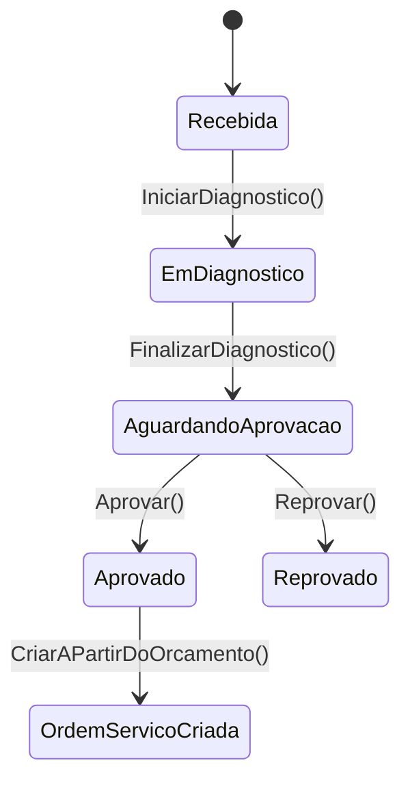

# 📐 DAS-002 — Fluxo de Orçamento e Aprovação da OS

> **Exemplo preenchido:** documento de apoio para registrar o fluxo de orçamento que antecede a ordem de serviço. A aprovação formal da feature deve ser feita no ciclo normal de revisão.

---

## 1. Cabeçalho e Metadados

| Campo | Valor |
|---|---|
| **ID** | `DAS-002` |
| **Feature** | Fluxo de Checklist → Orçamento → OS com rastreabilidade |
| **Autor** | Equipe de Arquitetura — exemplo |
| **Revisores técnicos** | Application, Domain, Infrastructure e API — a confirmar |
| **Aprovadores** | Product Owner e Arquiteto — a confirmar |
| **Data de criação** | `2026-08-01` |
| **Última revisão** | `2026-08-01` |
| **Versão** | `1.0` |
| **Status** | `APROVADO_COM_RESSALVAS` — exemplo didático |
| **Branch/Issue/PR** | `[preencher na feature real]` |
| **ADRs relacionados** | ADR-001, ADR-002, ADR-003, ADR-004, ADR-006 e ADR-007 |

### Ressalvas do exemplo

1. O checklist passa a ser o ponto de entrada do fluxo comercial.
2. O orçamento nasce em `RECEBIDA` e avança para diagnóstico, aprovação ou reprovação com rastreio de status.
3. A OS é criada a partir da aprovação do orçamento com seleção automática de mecânico e fallback para o mecânico do diagnóstico quando necessário.
4. Este DAS registra o desenho e o contrato atual do fluxo; mudanças futuras devem gerar nova versão.
5. O modelo de persistência usa relacionamentos explícitos entre `MotivoRecusaOrcamento` e `Orcamento`, e entre `HistoricoStatus` e as entidades `Orcamento` e `OrdemServico`.
6. A aplicação não usa `OnDelete(DeleteBehavior.Cascade)` nos relacionamentos ativos; a exclusão lógica é o padrão do domínio.

---

## 2. Contexto e Problema

### Contexto

A oficina precisa registrar um checklist de entrada antes de gerar o orçamento. O checklist concentra os dados do veículo e da pessoa, o orçamento concentra os itens previstos e o status comercial do atendimento até a aprovação ou reprovação, e a OS mantém o ciclo operacional.

### Problema

Sem o checklist como etapa anterior, a aplicação concentrava diagnóstico e execução no mesmo fluxo, dificultando rastrear a origem da vistoria, o histórico de status e a negociação com o cliente.

### Objetivo

Separar o ciclo de vistoria do ciclo comercial e do ciclo operacional: primeiro o checklist é finalizado, depois o orçamento é criado e transitado, e por fim a OS é gerada a partir da aprovação do orçamento.

---

## 3. Escopo

### Incluído

- Criação e atualização de orçamento.
- Criação e finalização de checklist vinculado a veículo e pessoa.
- Consulta paginada e consulta detalhada de orçamento.
- Transições de status do orçamento.
- Persistência de checklist, itens previstos, motivos de recusa e histórico de status.
- Criação da OS a partir da aprovação do orçamento com mecânico automático.
- Exposição de endpoints de orçamento e ajuste dos endpoints da OS.
- Testes de controller e validação de contrato.

### Fora de escopo

- Tela frontend.
- Integração com mensageria.
- Notificações por e-mail ou WhatsApp.
- Automatização de aprovação sem intervenção humana.

---

## 4. Requisitos

### 4.1 Requisitos funcionais

| ID | Requisito | Critério verificável |
|---|---|---|---|
| RF-001 | Criar checklist com veículo e pessoa | Checklist válido é persistido e pode ser finalizado |
| RF-002 | Atualizar orçamento existente | Campos e serviços previstos são persistidos corretamente |
| RF-003 | Consultar orçamento detalhado | Retorna checklist de origem, serviços previstos com peças e valores |
| RF-004 | Enviar orçamento ao cliente | `EM_DIAGNOSTICO → AGUARDANDO_APROVACAO` |
| RF-005 | Reprovar orçamento com motivo opcional | `AGUARDANDO_APROVACAO → REPROVADO` com motivo persistido |
| RF-006 | Reenviar orçamento após reprovação | `REPROVADO → EM_DIAGNOSTICO` |
| RF-007 | Aprovar orçamento | `AGUARDANDO_APROVACAO → APROVADO` e criação da OS |
| RF-008 | Ajustar OS ao novo fluxo | OS mantém transições operacionais com status rastreados |

### 4.2 Requisitos não funcionais

| ID | Categoria | Requisito |
|---|---|---|
| RNF-001 | Arquitetura | Regras de negócio permanecem no domínio |
| RNF-002 | Segurança | Endpoints administrativos exigem `ADMIN` |
| RNF-003 | Persistência | EF Core deve mapear orçamento, checklist, motivos de recusa e histórico de status |
| RNF-004 | Qualidade | APIs atualizadas devem ter cobertura de teste |

---

## 5. Design Proposto

### 5.1 Visão geral

### 5.2 Componentes principais

| Componente | Local | Responsabilidade |
|---|---|---|
| `Orcamento` | `src/Ofichina.Domain/Aggregates/Orcamento.cs` | Aggregate root do fluxo comercial |
| `Checklist` | `src/Ofichina.Domain/Entities/Checklist.cs` | Dados da entrada do veículo e finalização |
| `ItemOrcamento` | `src/Ofichina.Domain/Entities/ItemOrcamento.cs` | Serviços previstos do orçamento |
| `ItemOrcamentoPeca` | `src/Ofichina.Domain/Entities/ItemOrcamentoPeca.cs` | Peças vinculadas ao serviço previsto |
| `OrcamentoController` | `src/Ofichina.Api/Controllers/Orcamento/OrcamentoController.cs` | Endpoints públicos do orçamento |
| `OrdemServicoController` | `src/Ofichina.Api/Controllers/OrdemServico/OrdemServicoController.cs` | Fluxo operacional da OS |

### 5.3 Contratos expostos

- `GET /api/orcamentos`
- `GET /api/orcamentos/{id}`
- `POST /api/orcamentos`
- `PUT /api/orcamentos`
- `PUT /api/orcamentos/{id}/iniciar-diagnostico`
- `PUT /api/orcamentos/{id}/finalizar`
- `PUT /api/orcamentos/{id}/enviar`
- `PUT /api/orcamentos/{id}/aprovar`
- `PUT /api/orcamentos/{id}/reprovar`
- `PUT /api/orcamentos/{id}/reenviar`
- `POST /api/checklists`
- `PUT /api/checklists/{id}/finalizar`
- `GET /api/ordem-servico`
- `GET /api/ordem-servico/{id}`
- `PUT /api/ordem-servico/{id}/execucao`
- `PUT /api/ordem-servico/{id}/finalizar`
- `PUT /api/ordem-servico/{id}/entregar`
- `PUT /api/ordem-servico/{id}/cancelar`
- `DELETE /api/ordem-servico/{id}`

---

## 6. Validação e testes

### Estratégia

- Testes de integração para os controllers de checklist e orçamento.
- Testes de integração para o controller de ordem de serviço ajustado.
- Build completo da solução para validar o contrato e a composição.

### Critérios de aceite

- Os endpoints de checklist e orçamento retornam payloads coerentes com os contratos.
- O status persistido usa texto em UPPER_SNAKE_CASE e o histórico de mudanças é gravado.
- `MotivoRecusaOrcamento` mantém vínculo explícito com o orçamento e `HistoricoStatus` registra orçamento ou OS conforme o fluxo.
- A solução compila sem erros.

---

## 7. Riscos e observações

- A remoção dos endpoints diretos da OS exige alinhamento com consumidores externos.
- A aprovação do orçamento usa seleção automática de mecânico; o fallback para o mecânico do diagnóstico precisa continuar consistente.
- O fluxo depende de consistência entre contratos, handlers, domínio, persistência, histórico de status e relacionamentos explícitos.
- Exclusões físicas em cascata não devem ser introduzidas; o domínio opera com soft delete.

---

## 8. Aprovação

| Papel | Nome | Data | Assinatura |
|---|---|---|---|
| Product Owner | `[preencher]` | `[preencher]` | `[preencher]` |
| Arquiteto | `[preencher]` | `[preencher]` | `[preencher]` |
| Tech Lead | `[preencher]` | `[preencher]` | `[preencher]` |
