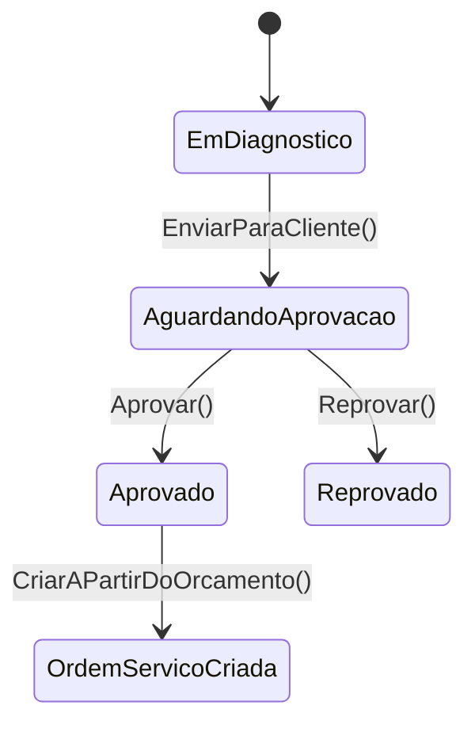

# 📐 DAS-002 — Fluxo de Orçamento e Aprovação da OS

> **Exemplo preenchido:** documento de apoio para registrar o fluxo de orçamento que antecede a ordem de serviço. A aprovação formal da feature deve ser feita no ciclo normal de revisão.

---

## 1. Cabeçalho e Metadados

| Campo | Valor |
|---|---|
| **ID** | `DAS-002` |
| **Feature** | Fluxo de Orçamento e criação da OS a partir de aprovação |
| **Autor** | Equipe de Arquitetura — exemplo |
| **Revisores técnicos** | Application, Domain, Infrastructure e API — a confirmar |
| **Aprovadores** | Product Owner e Arquiteto — a confirmar |
| **Data de criação** | `2026-08-01` |
| **Última revisão** | `2026-08-01` |
| **Versão** | `1.0` |
| **Status** | `APROVADO_COM_RESSALVAS` — exemplo didático |
| **Branch/Issue/PR** | `[preencher na feature real]` |
| **ADRs relacionados** | ADR-001, ADR-002, ADR-003, ADR-004, ADR-006 e ADR-007 |

### Ressalvas do exemplo

1. O orçamento é o ponto de entrada do fluxo de aprovação da OS.
2. A OS passa a ser criada a partir de um orçamento aprovado, preservando a regra de mecânico de diagnóstico diferente do mecânico de reparo.
3. Este DAS registra o desenho e o contrato atual do fluxo; mudanças futuras devem gerar nova versão.

---

## 2. Contexto e Problema

### Contexto

A oficina precisa registrar um orçamento antes de executar a ordem de serviço. O orçamento concentra os dados do veículo, checklist de entrada, itens previstos e o status comercial do atendimento até a aprovação ou reprovação.

### Problema

Sem o orçamento como etapa anterior, a aplicação concentrava a criação da OS e a aprovação do reparo no mesmo agregado, dificultando rastrear a negociação com o cliente e aplicar regras de negócio distintas para diagnóstico e reparo.

### Objetivo

Separar o ciclo comercial do ciclo operacional: primeiro o orçamento é criado, enviado, aprovado ou reprovado; depois a OS é gerada a partir do orçamento aprovado.

---

## 3. Escopo

### Incluído

- Criação e atualização de orçamento.
- Consulta paginada e consulta detalhada de orçamento.
- Transições de status do orçamento.
- Persistência de checklist e itens previstos.
- Criação da OS a partir da aprovação do orçamento.
- Exposição de endpoints de orçamento e ajuste dos endpoints da OS.
- Testes de controller e validação de contrato.

### Fora de escopo

- Tela frontend.
- Integração com mensageria.
- Notificações por e-mail ou WhatsApp.
- Automatização de aprovação sem intervenção humana.

---

## 4. Requisitos

### 4.1 Requisitos funcionais

| ID | Requisito | Critério verificável |
|---|---|---|---|
| RF-001 | Criar orçamento com pessoa, veículo, responsável, mecânico do diagnóstico, validade e itens previstos | Request válido cria orçamento em `EmDiagnostico` |
| RF-002 | Atualizar orçamento existente | Campos e itens são persistidos corretamente |
| RF-003 | Consultar orçamento detalhado | Retorna checklist e itens previstos |
| RF-004 | Enviar orçamento ao cliente | `EmDiagnostico → AguardandoAprovacao` |
| RF-005 | Aprovar orçamento | `AguardandoAprovacao → Aprovado` e criação da OS |
| RF-006 | Reprovar orçamento | `AguardandoAprovacao → Reprovado` |
| RF-007 | Ajustar OS ao novo fluxo | OS mantém apenas consulta e transições operacionais |

### 4.2 Requisitos não funcionais

| ID | Categoria | Requisito |
|---|---|---|
| RNF-001 | Arquitetura | Regras de negócio permanecem no domínio |
| RNF-002 | Segurança | Endpoints administrativos exigem `ADMIN` |
| RNF-003 | Persistência | EF Core deve mapear orçamento, checklist e itens previstos |
| RNF-004 | Qualidade | APIs atualizadas devem ter cobertura de teste |

---

## 5. Design Proposto

### 5.1 Visão geral

### 5.2 Componentes principais

| Componente | Local | Responsabilidade |
|---|---|---|
| `Orcamento` | `src/Ofichina.Domain/Aggregates/Orcamento.cs` | Aggregate root do fluxo comercial |
| `Checklist` | `src/Ofichina.Domain/Entities/Checklist.cs` | Dados da entrada do veículo |
| `ItemOrcamento` | `src/Ofichina.Domain/Entities/ItemOrcamento.cs` | Itens previstos do orçamento |
| `OrcamentoController` | `src/Ofichina.Api/Controllers/Orcamento/OrcamentoController.cs` | Endpoints públicos do orçamento |
| `OrdemServicoController` | `src/Ofichina.Api/Controllers/OrdemServico/OrdemServicoController.cs` | Fluxo operacional da OS |

### 5.3 Contratos expostos

- `GET /api/orcamentos`
- `GET /api/orcamentos/{id}`
- `POST /api/orcamentos`
- `PUT /api/orcamentos`
- `PUT /api/orcamentos/{id}/enviar`
- `PUT /api/orcamentos/{id}/aprovar/{mecanicoReparoId}`
- `PUT /api/orcamentos/{id}/reprovar`
- `GET /api/ordem-servico`
- `GET /api/ordem-servico/{id}`
- `PUT /api/ordem-servico/{id}/execucao`
- `PUT /api/ordem-servico/{id}/finalizar`
- `PUT /api/ordem-servico/{id}/entregar`
- `PUT /api/ordem-servico/{id}/cancelar`
- `DELETE /api/ordem-servico/{id}`

---

## 6. Validação e testes

### Estratégia

- Testes de integração para o controller de orçamento.
- Testes de integração para o controller de ordem de serviço ajustado.
- Build completo da solução para validar o contrato e a composição.

### Critérios de aceite

- Os endpoints de orçamento retornam payloads coerentes com os contratos.
- A OS não expõe mais criação/atualização direta pelo controller.
- A solução compila sem erros.

---

## 7. Riscos e observações

- A remoção dos endpoints diretos da OS exige alinhamento com consumidores externos.
- A aprovação do orçamento cria a OS com dados derivados do checklist e dos itens previstos; mudanças no agregado devem manter esse contrato.
- O fluxo depende de consistência entre contratos, handlers, domínio e persistência.

---

## 8. Aprovação

| Papel | Nome | Data | Assinatura |
|---|---|---|---|
| Product Owner | `[preencher]` | `[preencher]` | `[preencher]` |
| Arquiteto | `[preencher]` | `[preencher]` | `[preencher]` |
| Tech Lead | `[preencher]` | `[preencher]` | `[preencher]` |
